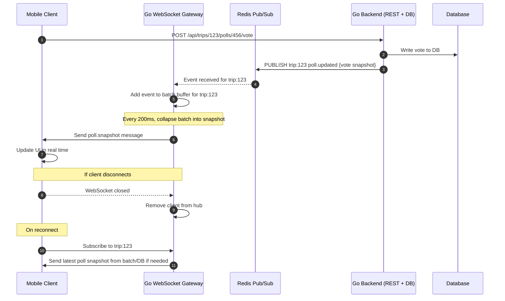

Current architecture choice:

```mermaid
sequenceDiagram
    autonumber
    participant MobileClient as Mobile Client
    participant Gateway as Go WebSocket Gateway
    participant Redis as Redis Pub/Sub
    participant Backend as Go Backend (REST + DB)
    participant DB as Database

    MobileClient->>Backend: POST /api/trips/123/polls/456/vote
    Backend->>DB: Write vote to DB
    Backend->>Redis: PUBLISH trip:123 poll.updated {vote snapshot}

    Redis-->>Gateway: Event received for trip:123
    Gateway->>Gateway: Add event to batch buffer for trip:123
    Note over Gateway: Every 200ms, collapse batch into snapshot

    Gateway->>MobileClient: Send poll.snapshot message
    MobileClient->>MobileClient: Update UI in real time

    Note over MobileClient, Gateway: If client disconnects
    MobileClient-->>Gateway: WebSocket closed
    Gateway->>Gateway: Remove client from hub

    Note over MobileClient: On reconnect
    MobileClient->>Gateway: Subscribe to trip:123
    Gateway->>MobileClient: Send latest poll snapshot from batch/DB if needed
```