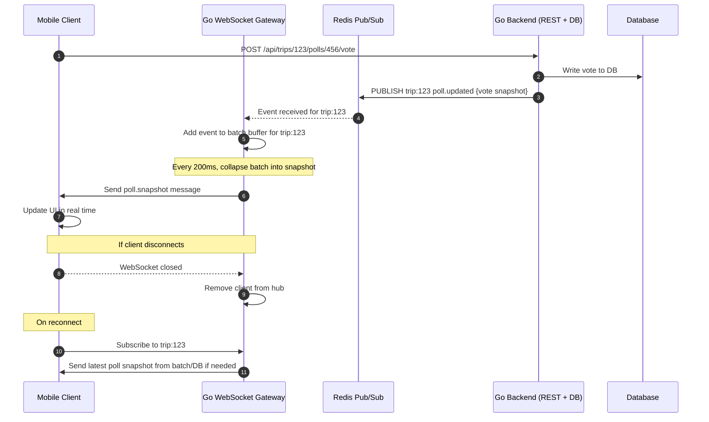

# Realtime System

WebSocket-based real-time event broadcasting using Redis pub/sub for horizontal scaling.

Note: MVP includes this realtime service gateway in the same application as backend. We recommend splitting it up into its own microservice in the near future.

## Architecture



## How It Works

### Connection Management
- **One WebSocket per user** - Single connection handles all trip subscriptions
- **In-memory storage** - Client connections stored on each backend pod (~60-85KB per connection)
- **Horizontal scaling** - Deploy multiple pods, Redis broadcasts events to all instances
- **Capacity** - 10K-50K connections per pod typical

### Subscription Model
```
Hub:
  - clients: map[*Client]bool              // All connections on this pod
  - tripSubscribers: map[tripID]map[*Client]bool  // Trip → clients mapping

Client:
  - Subscriptions: map[tripID]bool         // Tracks which trips this client follows
```

When user subscribes to multiple trips, they receive events only for their subscribed trips over the single connection.

### Event Flow
1. REST API writes to DB
2. REST API publishes event to Redis: `PUBLISH trip:123 {"topic": "poll.updated", "data": {...}}`
3. All backend pods receive the Redis event
4. Each pod delivers to its subscribed clients
5. Client receives batched events every 200ms

## Usage Guide

### 1. Define Event Topic
Add to `internal/realtime/registry.go`:
```go
func (r *EventRegistry) registerDefaultTopics() {
    topics := []string{
        // ... existing topics
        "poll.vote_added",    // New poll event
    }
}
```

### 2. Publish Event from REST Handler
```go
import "toggo/internal/realtime"

func (s *PollService) AddVote(ctx context.Context, pollID, userID string) error {
    // Write to DB
    if err := s.repo.AddVote(pollID, userID); err != nil {
        return err
    }

    // Get updated poll data
    poll, _ := s.repo.GetPoll(pollID)

    // Publish realtime event
    event, _ := realtime.NewEvent("poll.vote_added", poll.TripID, poll)
    s.publisher.Publish(ctx, event)

    return nil
}
```

### 3. Client Subscription (Frontend)
```typescript
const ws = new WebSocket('ws://localhost:8080/ws');

// Subscribe to trip
ws.send(JSON.stringify({
  type: 'subscribe',
  trip_id: 'trip-123'
}));

// Handle events
ws.onmessage = (msg) => {
  const data = JSON.parse(msg.data);
  if (data.type === 'events') {
    data.events.forEach(event => {
      switch(event.topic) {
        case 'poll.vote_added':
          updatePollUI(event.data);
          break;
      }
    });
  }
};
```

### 4. Unsubscribe
```typescript
ws.send(JSON.stringify({
  type: 'unsubscribe',
  trip_id: 'trip-123'
}));
```

## Message Types

### Client → Server
```json
{"type": "subscribe", "trip_id": "trip-123"}
{"type": "unsubscribe", "trip_id": "trip-123"}
{"type": "ping"}
```

### Server → Client
```json
{
  "type": "events",
  "events": [
    {
      "topic": "poll.vote_added",
      "trip_id": "trip-123",
      "data": {"poll_id": "456", "votes": [...]},
      "timestamp": "2026-02-03T10:30:00Z"
    }
  ],
  "timestamp": "2026-02-03T10:30:00Z"
}
```

```json
{"type": "pong", "timestamp": "2026-02-03T10:30:00Z"}
```

## Available Event Topics

| Topic | Description |
|-------|-------------|
| `poll.created` | New poll created |
| `poll.updated` | Poll details changed |
| `poll.deleted` | Poll removed |
| `poll.vote_added` | User voted |
| `poll.vote_removed` | Vote removed |
| `trip.created` | New trip created |
| `trip.updated` | Trip details changed |
| `trip.deleted` | Trip removed |
| `membership.added` | User joined trip |
| `membership.removed` | User left trip |
| `membership.updated` | Member role changed |
| `comment.created` | New comment posted |
| `comment.updated` | Comment edited |
| `comment.deleted` | Comment removed |
| `file.uploaded` | File added to trip |
| `file.deleted` | File removed |
| `notification.sent` | Push notification sent |

## Scaling Considerations

**Memory per pod:** 10K connections = ~600-850MB RAM

**For millions of users:**
- Deploy 100+ pods behind load balancer
- Each pod handles 10K-50K connections
- Redis broadcasts events to all pods
- Use sticky sessions to keep users on same pod during session

**No Redis storage needed** - connections must be in-memory on the pod handling them.
